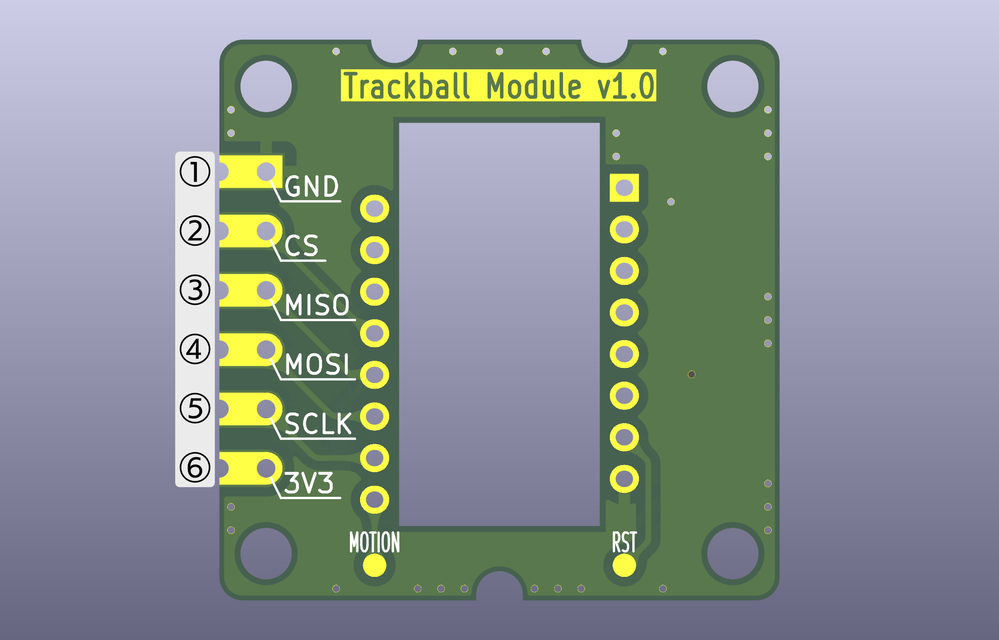
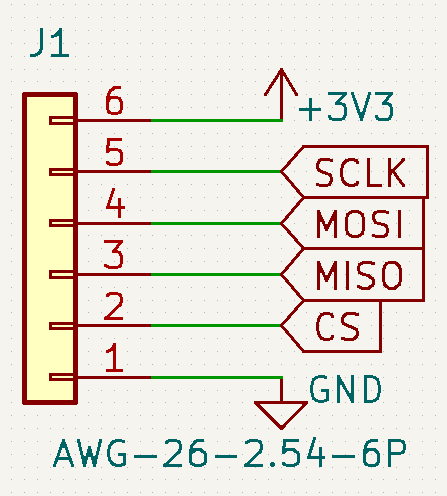
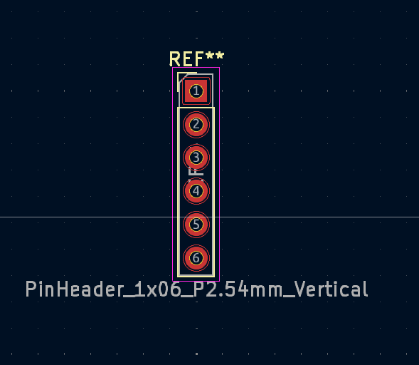
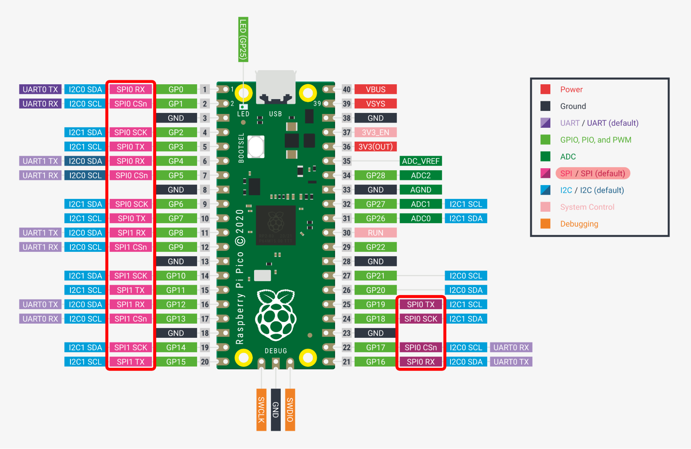
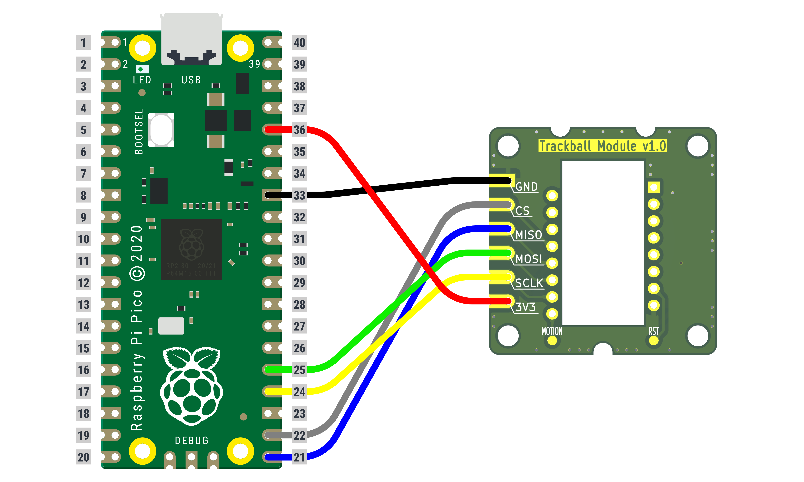
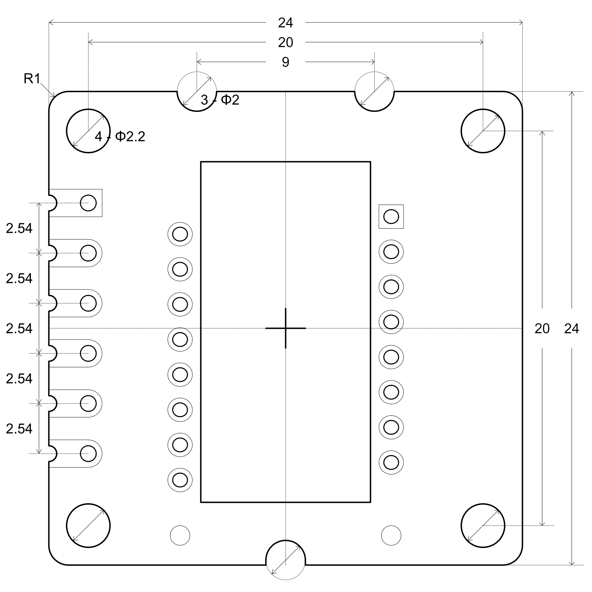

# Trackball module 開発者用ドキュメント

>[!Caution]
>本ドキュメントは、Trackball moduleおよびPMW3360をご自身で開発されているキーボードに搭載する際の技術的な注意事項を記載しております。
>組み立てについてはこちらのドキュメントをご確認ください。

## 概要
Trackball moduleは、自作キーボード向けに設計されたPMW3360ブレイクアウトボードです。
主な特徴は以下の通りです。

- PMW3360に対応（SPI通信）
- トラックボール用基板の設計が不要
- 複数種類のトラックボールケースが用意予定

---

## Trackball moduleの採用方法

### キーボード基板設計

KiCadでの設計を想定しています。
他CADでの対応の検証はしていませんが、適宜読み替えていただくことで使用することが可能です。

#### 1. ピン配置

Trackball moduleのピン配置は以下の通りです。
PMW3360とマイコン間の通信にはSPI（Serial Peripheral Interface）を使用します。

| ピン名 | 機能 | 説明 |
| :--- | :--- | :--- |
| 1 | GND | GND |
| 2 | CS | チップ・セレクト |
| 3 | MISO | メイン入力・サブノード出力 |
| 4 | MOSI | メイン出力・サブノード入力 |
| 5 | SCLK | クロック |
| 6 | 3V3 | 3.3V電源 |



#### 2. 回路図(シンボルと接続例)
**シンボル**
KiCadの標準ライブラリに含まれる *Connector_Generic:Conn_01x06* がそのまま使用できます。
シンボルライブラリより上記を使用してください。

**接続例**
一般的なマイコンボード（Pro Micro, Raspberry Pi Pico）やMCU（Atmega32U4, RP2040など）への接続例です。

- 電源部分（1,6）:
    - 1ピンはマイコンのGNDと接続してください。
    - 6ピンはマイコンの3.3Vピンと接続してください。
    ※5Vの場合は電圧レギュレータを使用して5Vを3.3Vにする（推奨）か、ダイオードを通して電圧降下させてください。
- SPI通信部分（2～5）:
    - 2ピンはCSピン（CSnピン）と接続します。ProMicroでは好きなピンが使用できます。
    - 3ピンはMISOピン（RXピン）と接続します。
    - 4ピンはMOSIピン（TXピン）と接続します。
    - 5ピンはSCLKピン（SCKピン）と接続します。
    ※SPI通信はピンによって対応していない場合があります。使用するマイコンボードのデータシートをよくご確認の上ご利用ください。
    ※Pro Microで使用する場合は、[レベルシフタ](https://www.switch-science.com/products/1779)などを経由することでより安全に使用できます。



#### 3.フットプリント
KiCadの標準ライブラリに含まれる *PinSocket_1x06_P2.54_Vertical* などの2.54mmピッチで6ピンのフットプリントを使用することができます。


#### 4. 配線イメージ
Raspberry Pi Picoでご使用になる場合、SPI0またはSPI1のいずれか一方に統一して使用する必要があります。



Raspberry Pi PicoとTrackball moduleの接続対応関係は以下の通りです。

| No. | Raspberry Pi Pico | Trackball Module |
| :--- | :---: | :---: |
| 1 | GND | GND |
| 2 | CSn | CS |
| 3 | RX | MISO |
| 4 | TX | MOSI |
| 5 | SCK | SCLK |
| 6 | 3V3(OUT) | 3V3 |

今回は下記のようにSPI0側で接続を行います。


（補足：実際のキーボード基板では、配線部分をピンヘッダやコネクタなどでマイコンから引き出すことで、より簡単に使用できます。）

### 物理的制約と寸法（ケースデザイン）

- **基板形状：**


- **高さ：**
センサー+基板+レンズ部合計：7.4mm（実測値）

### ファームウェア (QMK/VIA/Remap)

QMK Firmware (およびVIA/Remap) で設定する場合、以下の方法があります。
詳しい実装方法は[Pointing Device | QMK Firmware](https://docs.qmk.fm/features/pointing_device)をご確認ください。
また、[Practice BallのQMK Firmware](https://github.com/yushakobo/qmk_firmware/tree/master/keyboards/yushakobo/practice_ball)を確認し、参考にしていただいても構いません。
※プログラム実装方法がわからないなどのお問い合わせはお答えいたしかねます。

1. rules.mk に以下のコードを追加してください。
rules.mk というファイルがない場合は
qmk_firmware/keyboards/[your_keyboard]
内に rules.mk というファイルを作成し、以下を記述してください。

```
POINTING_DEVICE_ENABLE = yes
POINTING_DEVICE_DRIVER = pmw3360
```

2. config.h に以下のコードを追加してください。
config.h というファイルがない場合は
qmk_firmware/keyboards/[your_keyboard]
内に config.h というファイルを作成し、以下を記述してください。

```
/* trackball settings */
#ifdef POINTING_DEVICE_ENABLE
#define PMW33XX_CS_PIN GP17
#define SPI_MISO_PIN GP16
#define SPI_MOSI_PIN GP19
#define SPI_SCK_PIN GP18
#define PMW33XX_CPI 1600
#define PMW33XX_CLOCK_SPEED 2000000
#define MOUSE_EXTENDED_REPORT
// 以下は取り付け向きに合わせて変更してください。
#define POINTING_DEVICE_INVERT_X //X方向を反転させます
//#define POINTING_DEVICE_INVERT_Y Y方向を反転させます
//#define POINTING_DEVICE_ROTATION_90 中心を90度回転させます
#endif
//GP16〜19は、対応するGPIOに合わせて変更してください。
```

3. halconf.hに以下のコードを追加してください。（ARM系マイコンのみ）

```
#pragma once

#define HAL_USE_SPI TRUE

#include_next "halconf.h"
```

4. mcuconf.hに以下のコードを追加してください。（ARM系マイコンのみ）

```
#pragma once

#include_next "mcuconf.h"

#undef RP_SPI_USE_SPI0
#define RP_SPI_USE_SPI0 TRUE //SPI0かSPI1を有効にします
//RP_SPI_USE_SPI0（もしくはSPI1）は、対応するGPIOに合わせて変更してください。
```

5. ファームウェアをビルドしマイコンに書き込みをしてください。

### 参考資料
- マイコンボードのデータシート
  - [Pro Micro](https://cdn.sparkfun.com/datasheets/Dev/Arduino/Boards/ProMicro16MHzv1.pdf)
  - [Raspberry Pi Pico](https://pip-assets.raspberrypi.com/categories/610-raspberry-pi-pico/documents/RP-008307-DS-1-pico-datasheet.pdf?disposition=inline)
- MCUのデータシート
  - [Atmega32U4](https://ww1.microchip.com/downloads/en/devicedoc/atmel-7766-8-bit-avr-atmega16u4-32u4_datasheet.pdf)
  - [RP2040](https://pip-assets.raspberrypi.com/categories/814-rp2040/documents/RP-008371-DS-1-rp2040-datasheet.pdf?disposition=inline)